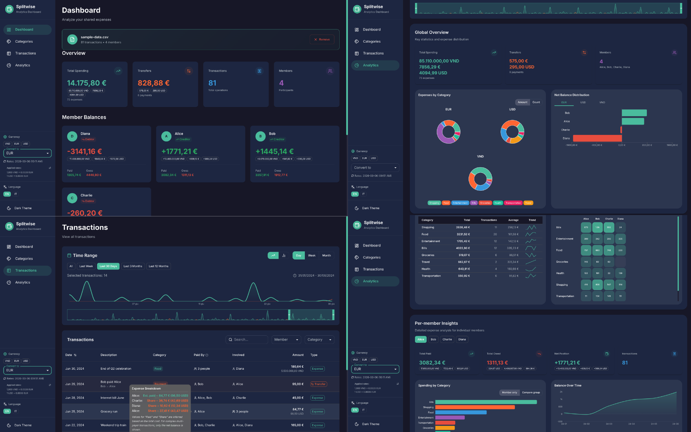
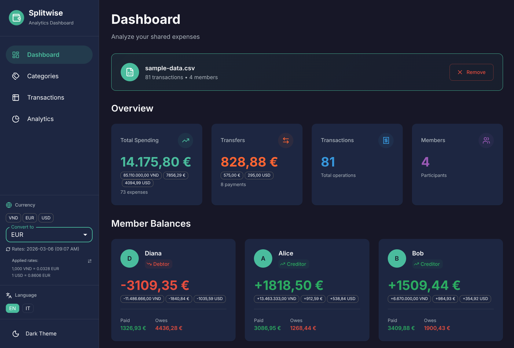
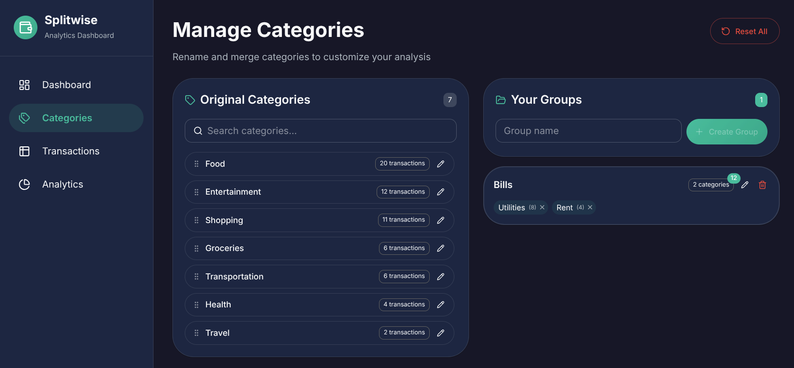
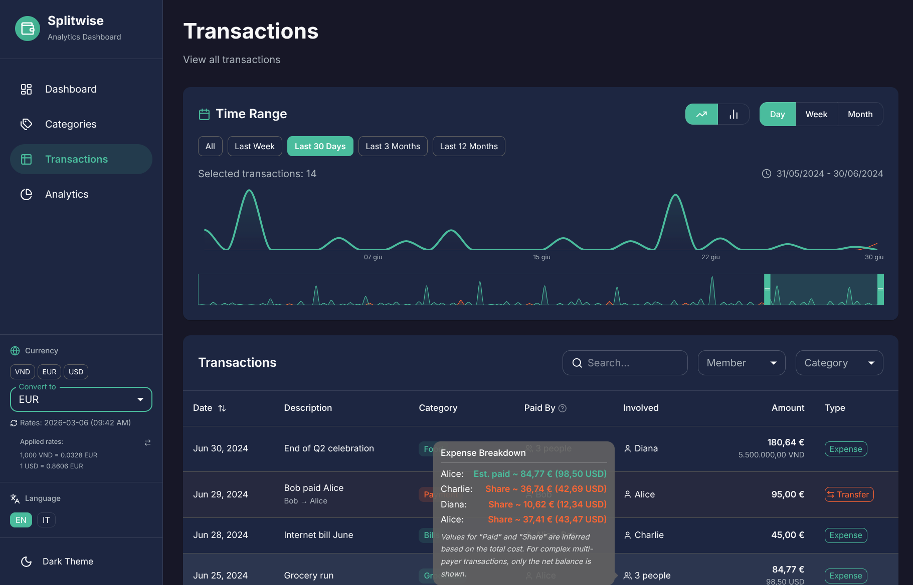
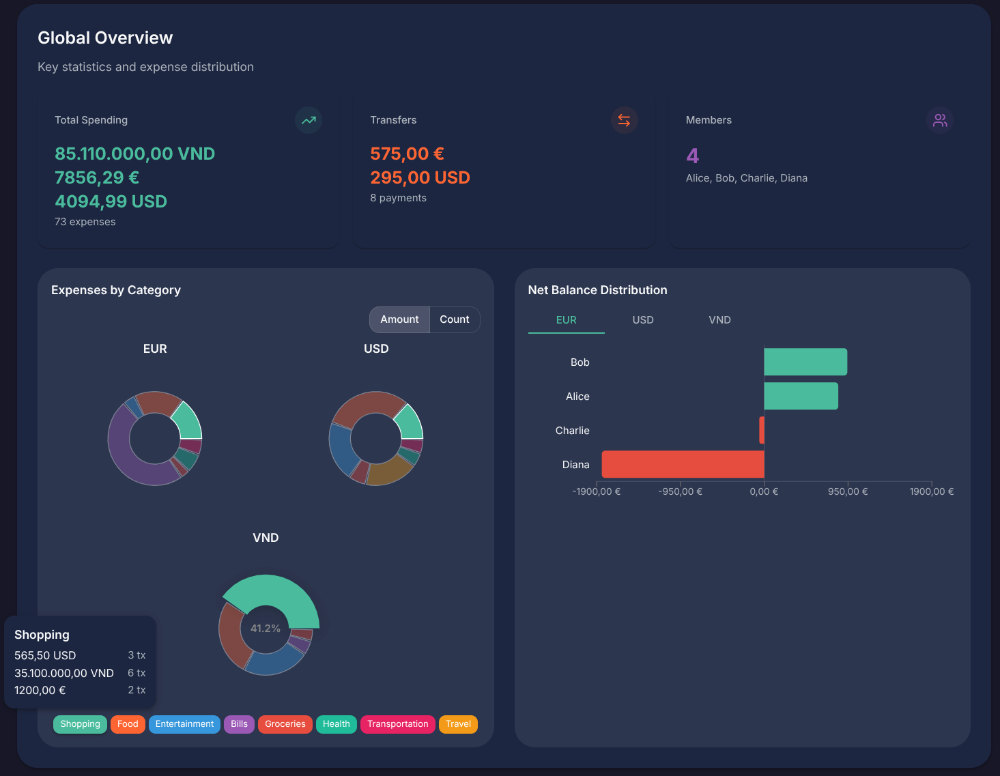
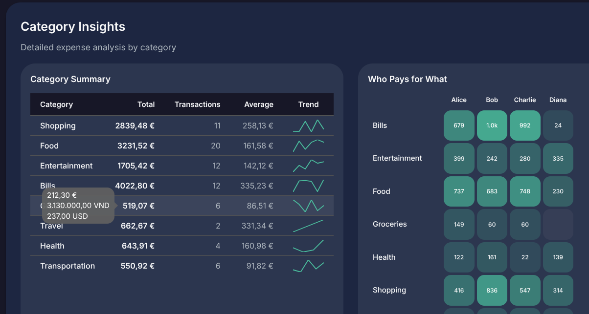
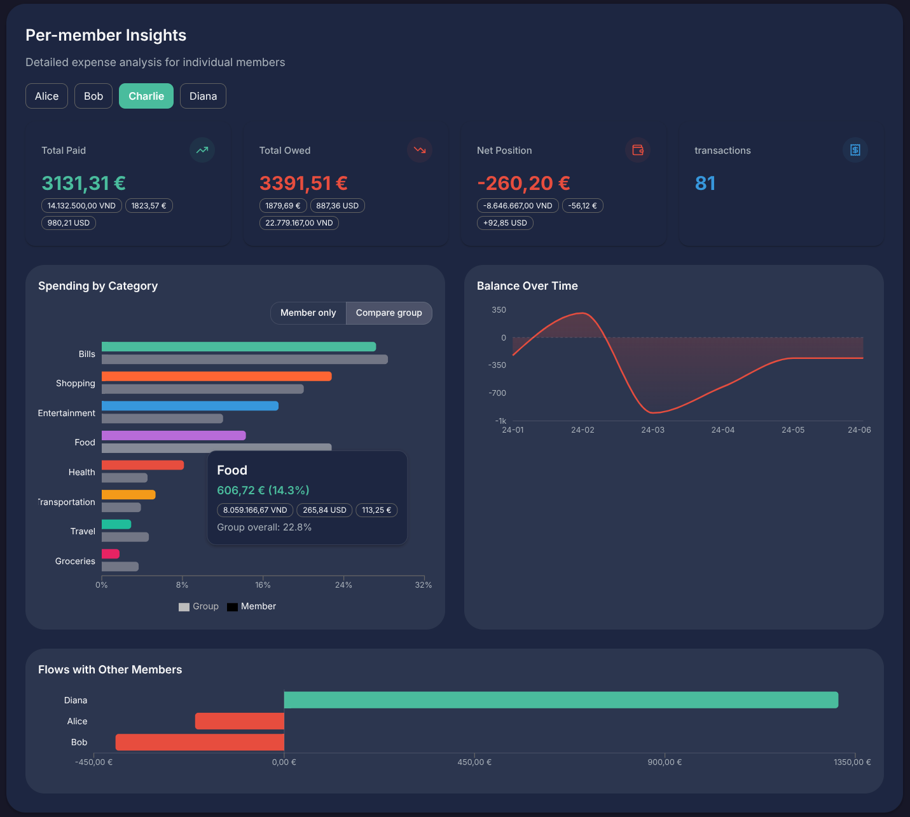
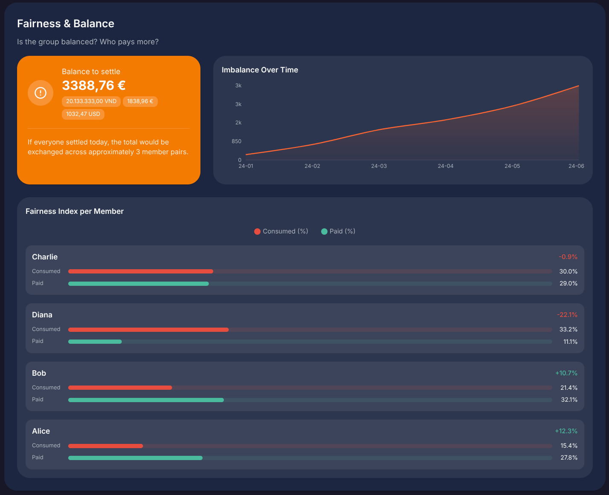

# 💸 Splitwise CSV Analytics

Analytics for your .csv Splitwise exports.

A responsive web application for visualizing your Splitwise shared expenses. This project takes your standard Splitwise exports and turns them into clean, insightful charts and summaries, helping you truly understand where your money went and who owes what.

_Mostly vibe coded in a day, because of course._



## Main features

- A bird's-eye view of your group's total spending and net balances.
- A timeline of your expenses to spot trends.
- A searchable, filterable transaction table.
- A variety of insightful analytics on categories, members, and group fairness.
- Category customization (rename and merge) to personalize your analytics.
- Multi-currency support with real-time exchange rate conversion.
- Multi-language support (currently English and Italian).

## How to Use It

1. Export your group or personal transactions from Splitwise (as a `.csv` file).
2. Open the dashboard and click the upload area (or just click "Load sample data" to play around).
3. The app parses the data instantly in your browser.

### Hosting

Since it's a completely client-side application (built with Vite + React), it can be **hosted on GitHub Pages**, or you can self-host it on any static file server.
There is **no database** and **no backend**—your data never leaves your browser.
To run it locally:

```bash
npm i
npm run dev
```

## Sections Overview

### 1. Dashboard: Global Stats & Members Summary

Get a quick top-level summary of the total expenses and individual member balances.


### 2. Categories: rename and merge as you please

Categories from CSV can be messy, so you can rename and merge them to get a cleaner overview in the next sections.



### 3. Transactions Table

A data table that lists every transaction, with sorting and filtering built-in. Hover on people to get the expense's detailed split.

⚠️ Note: values for "paid" and "share" are inferred based on total cost, and may not reflect reality. In the CSV export, it is not explicitly specified who paid what, only the balance difference for each person for each transaction. Therefore, it is generally assumed that only one person paid the total cost, which is the most likely scenario anyway. In the data source, this is stored as one person having a positive balance and the rest having a negative balance. If its positive balance does not match the total cost, it is inferred that the difference is its share. For example, the hovered transaction in the screenshot is inferred from the following data:

```
Date,Description,Category,Cost,Currency,Alice,Bob,Charlie,Diana
2024-06-25,Grocery run,Groceries,98.50,USD,55.03,0.00,-42.69,-12.34
```



### 4. Analytics

Get insights into the expenses with a variety of widgets:

- **Time Range Filter**: Slide through different time periods to filter the entire dashboard. The charts, stats, and tables will instantly update to reflect only the selected time range.

- **Global overview**: see category breakdown pie charts, and member net balance distributions. (Note that data and plots can be always be merged by enabling currency conversion)
  

- **Category insights**: show category totals as a table, trends of each category, and who pays for what.
  

- **Member insights**: for each member, show their total expenses, their distributions, trends over time, and how they compare to the group.
  

- **Group fairness**: show how fair the expenses are distributed among the group members.
  

## 💱 Currency Conversion

One of the coolest (and trickiest) features of this dashboard is **multi-currency support**. If your Splitwise export contains expenses in multiple currencies (e.g., EUR, USD, VND), the dashboard seamlessly handles it: it can show the expenses in their original currency or convert them to a preferred currency.

**How it works:**

- The app detects all unique currencies in your dataset.
- Using a side-panel selector, you can choose a "Preferred Currency".
- The app fetches real-time exchange rates (using a free API) and dynamically converts **every single transaction** into your preferred currency.
- It doesn't just convert the grand totals; it recalculates the member net positions, the category charts, and the timeline data so you get a mathematically accurate view of your spending in one unified currency.

For some widgets, like the time range filter, an underlying silent conversion is always used, even if the conversion is turned off, to accurately show the true value as one line.

_Note: Since historical exact exchange rates aren't available for free without heavy API usage, the app uses the *latest* exchange rates to give you a strong estimate of the current value of your past trips._

## That's about it

Suggestions are welcome. Critiques are even more welcome. PRs, sure. If you load your data and you find inconsistencies, please let me know! If other similar apps exist, I'd love to adapt the backend to manage their exports too.

_Built with React, Recharts, and Material UI // Opus 4.6 and Gemini 3.1 Pro_.
